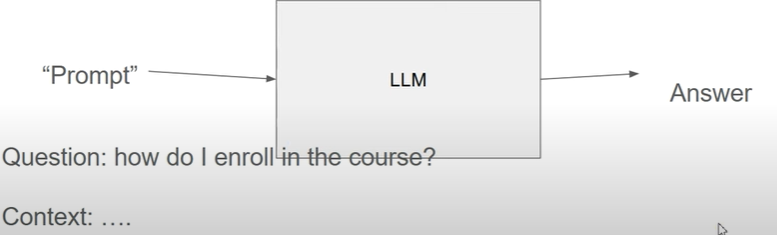
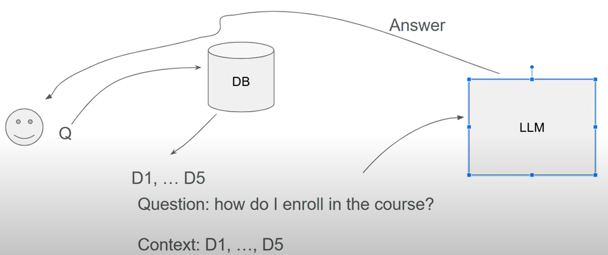

## 🧠 Parte 1 – Introdução aos LLMs e ao RAG

### 📌 Objetivo do Curso

* Curso prático focado em **LLMs (Modelos de Linguagem de Grande Escala)** e **RAG (Retrieval-Augmented Generation)**.
* Projeto principal: construir um sistema de perguntas e respostas baseado em documentos de FAQ dos cursos da comunidade DataTalks.Club.
* Problema: documentos FAQ extensos (ex. 321 páginas) são difíceis de navegar manualmente.


### 🤖 O que são LLMs?

* **LLM = Large Language Model** (Modelo de Linguagem de Grande Escala).
* Treinados com grandes volumes de texto e bilhões de parâmetros.
* Principal tarefa: prever a próxima palavra/token com base no contexto anterior.
* Exemplo: sugestões automáticas de texto no celular.
* Comportamento sofisticado que simula conversa humana (ex: ChatGPT).
* Neste curso, os LLMs serão usados como **caixas-pretas** (sem aprofundar na teoria).


### ✍️ Como funciona um LLM na prática?

* Entrada: um **prompt** (ex: pergunta do aluno).
* Saída: uma **resposta gerada** pelo modelo.
* Exemplo de prompt:

  ```
  Pergunta: Como me inscrevo no curso?
  Contexto: [texto extraído dos documentos FAQ]
  Resposta: [gerada pelo LLM]
  ```


### 🔍 O que é RAG (Retrieval-Augmented Generation)?

* **RAG = Recuperação + Geração**.
* Combina:

  * **Recuperação de informações** (busca em base de conhecimento);
  * **Geração de texto** com LLM.
* RAG é usado quando o LLM **não tem a informação na base de treino**.
* Exemplo:

  * Pergunta: “É tarde demais para entrar no curso?”
  * LLM puro: resposta vaga ou errada.
  * Com RAG: busca em documentos FAQ e gera resposta com base no conteúdo real.

### 🧱 Arquitetura de um sistema RAG

1. **Usuário faz uma pergunta (Q)**.
2. O sistema envia a pergunta para uma **base de conhecimento (FAQ, documentos)**.
3. Recupera os documentos mais relevantes (ex: D1, D2... D5).
4. Esses documentos são usados como **contexto**.
5. O **LLM gera uma resposta** com base nesse contexto.


### 🛠️ O que será construído no curso

* Um sistema simples com formulário:

  * Usuário digita a pergunta.
  * O sistema responde com base nas FAQs usando RAG.
* Ferramentas: LLMs + Técnicas de recuperação de informações.

---

## 📦 Parte 2 — Configurando o Ambiente

### 🛠️ Opções de Ambiente

* O instrutor usa **GitHub Codespaces**, mas:

  * Você **pode usar localmente** (com Docker instalado),
  * Ou plataformas como **Google Colab**, **AWS SageMaker**, **Cocalc** etc.
* Neste módulo, **não é necessário GPU**, apenas no próximo.

### 🚀 Usando GitHub Codespaces

1. **Criar repositório GitHub**:

   * Nome sugerido: `llm-zoomcamp`
   * Deve ser **público** (para envio das tarefas)
   * `.gitignore`: escolha `Python`
2. **Abrir com Codespaces**:

   * Clicar em **Code > Codespaces > Create Codespace**
   * Ambiente roda no navegador com **VS Code**
   * Sugestão: abrir também no **VS Code Desktop** (melhor experiência)
   * Instalar extensão **Codespaces** no VS Code

### 🐍 Verificando o ambiente

* Docker e Docker Compose já disponíveis
* Python pré-instalado

### 📚 Instalação de Bibliotecas com `pip`

```bash
pip install jupyter==7.1.2 openai elasticsearch pandas
```

* `jupyter==7.1.2`: interface de notebooks
* `openai`: API da OpenAI
* `elasticsearch`: usado no fim do módulo
* `pandas`: manipulação de dados
* `tqdm`: barra de progresso (usado mais tarde)

### 🔑 Configuração da API da OpenAI

1. Acesse: [platform.openai.com](https://platform.openai.com)
2. Vá em **API Keys** > Crie uma chave
3. **Nunca compartilhe** a chave (segurança!)
4. Armazene como **variável de ambiente**:

```bash
export OPENAI_API_KEY="sua-chave-aqui"
```

### 🧪 Testando o ambiente com o Jupyter

1. Rode o Jupyter Notebook:

```bash
jupyter notebook
```

2. Acesse via navegador: `localhost:8888`
3. Teste simples:

```python
import openai

client = openai.OpenAI(api_key="SUA_CHAVE")

response = client.chat.completions.create(
    model="gpt-4",
    messages=[{"role": "user", "content": "É tarde demais para entrar no curso?"}]
)

print(response.choices[0].message.content)
```

### 💡 Alternativa: Usando Anaconda

* Instale com:

```bash
wget https://repo.anaconda.com/archive/Anaconda3-<versão>-Linux-x86_64.sh
bash Anaconda3-<versão>-Linux-x86_64.sh
```

* Mais pesado (\~1GB), mas já inclui várias libs úteis
* Não é necessário instalar libs manualmente após

Claro! Aqui está o **resumo em tópicos** da **Parte 3** do vídeo "[LLM Zoomcamp 1.3 - Retrieval and Search](https://www.youtube.com/watch?v=olvem333Bqo)" com base na transcrição:

## 🧠 Parte 3 - Recuperação e Pesquisa

#### 📌 Visão Geral

* Revisão da arquitetura **RAG (Retrieval-Augmented Generation)**:

  * Dois componentes principais: **Banco de Dados (mecanismo de busca)** e **LLM**.
* Nesta etapa: foco em **recuperar documentos relevantes** usando um mecanismo de busca simples antes de enviar para o LLM.

### 🛠️ Implementação do Mecanismo de Busca

#### 🔹 Workshop anterior

* Baseado no workshop “Implementando um mecanismo de busca” (repositório do curso).
* Mecanismo em memória, **não pronto para produção**, apenas para fins educacionais.

#### 🔹 Setup do mecanismo

* Uso de um script Python (`search.py`) baixado via `wget`.
* Carregamento dos dados de FAQ em formato JSON.

### 📁 Preparação dos Dados

* Cada item do JSON representa um curso (ex: ML Zoomcamp) com documentos internos.
* Transformação dos dados:

  * Estrutura simplificada para uma **lista plana de documentos**.
  * Adição do campo `course` para identificação.

### 🔍 Indexação

* Criação de um índice com a função `fit()` (parecido com o Scikit-learn).
* **Tipos de campos:**

  * `text_fields`: usados para **similaridade semântica** (ex: `question`, `section`).
  * `keyword_fields`: usados para **filtros exatos** (ex: `course`).


### 🔎 Realizando Buscas

#### 📌 Exemplo de busca:

> "O curso já começou, ainda posso me inscrever?"

* Parâmetros da busca:

  * **Query**: a pergunta do usuário.
  * **Boost**:

    * Aumenta a relevância de certos campos (ex: `question` com peso 3).
  * **Top\_k**: número de resultados retornados.
  * **Filter**: restringe por curso (ex: apenas `Data Engineering Zoomcamp`).

#### ✅ Resultado

* Recuperação de documentos relevantes, mesmo com variações semânticas ("participar" ≠ "inscrever-se").
* Filtro aplicado para garantir que os documentos sejam do curso correto.

### 💡 Conclusão

* Base de conhecimento foi indexada com sucesso.
* Agora é possível recuperar documentos relevantes a partir de uma consulta.
* Próximo passo: **inserir os documentos em um LLM** para gerar respostas contextualizadas (próximo vídeo).
---

## 📌 Parte 4 – Gerando Respostas com GPT-4o

### 🎯 Objetivo da Aula

* Mostrar como **usar um LLM (GPT-4o)** para **gerar respostas** baseadas em contexto recuperado de uma base de conhecimento.
* Complementa as etapas anteriores de *indexação e recuperação* com uma etapa de **geração** (G da pipeline RAG – Retrieval-Augmented Generation).

### ⚙️ Contexto Inicial

* Até aqui, o pipeline permite:

  * Fazer uma pergunta (ex: “O curso já começou? Ainda posso me inscrever?”).
  * Recuperar documentos relevantes da base de conhecimento (via busca densa/simples).
* Próximo passo: usar os documentos recuperados para **gerar uma resposta com um LLM**, incorporando o conteúdo ao prompt.

### 🔧 Configuração

* LLM escolhido: **GPT-4o** (via OpenAI API), por ser mais barato e rápido que o GPT-4.
* API Key da OpenAI foi configurada via variável de ambiente.
* Cliente: `openai` importado e usado com a API `chat.completions`.

### ✉️ Primeira tentativa simples

* Enviou apenas a pergunta do usuário no prompt:

  ```python
  messages = [{"role": "user", "content": question}]
  ```
* Resposta foi **genérica e superficial**, pois o modelo não tinha acesso ao conteúdo da base de conhecimento.

### 🧠 Engenharia de Prompt (Prompt Engineering)

Para melhorar a resposta:

1. **Criou um template de prompt com papel (role):**

   * Exemplo de system message:

     ```python
     {"role": "system", "content": "Você é um assistente de ensino do curso."}
     ```

2. **Instruções adicionais no prompt:**

   * “Use **apenas os fatos do contexto** ao responder.”
   * “Se o contexto não contiver a resposta, diga isso explicitamente.”

3. **Combinação do contexto com a pergunta:**

   ```python
   prompt = f"""Você é um assistente de ensino do curso.
   Responda à pergunta com base no conteúdo abaixo.
   Use apenas os fatos do contexto ao responder.

   CONTEXTO:
   {context}

   PERGUNTA:
   {question}
   """
   ```

### 🗃️ Construção do Contexto

* Iterou sobre os documentos recuperados (`results`) e extraiu:

  * `section`, `question`, `answer` de cada documento.
  * Formatou como texto com quebras de linha para clareza.

Exemplo de estrutura:

```
Seção: Introdução
Pergunta: Quando começa o curso?
Resposta: O curso começou no dia 1º de maio.
```

### 🤖 Envio do Prompt ao LLM

* O prompt formatado foi enviado ao `openai.ChatCompletion.create()` com `model="gpt-4o"`.
* Exemplo de resposta gerada:

  > "Sim, mesmo que o curso já tenha começado, você ainda pode se inscrever. Esteja atento aos prazos das tarefas e do projeto final."

### ✅ Resumo do Pipeline até aqui

1. **Entrada:** Pergunta do usuário.
2. **Recuperação:** Busca por documentos relevantes na base de conhecimento.
3. **Geração:** Prompt com contexto e pergunta é enviado ao LLM, que gera a resposta.
4. **Saída:** Resposta final é entregue ao usuário.

### 🔄 Próximos Passos

* Refatorar o código:
  * Modularizar: separar em funções reutilizáveis.
  * Facilitar a troca de componentes (ex: mudar o banco de dados ou o modelo LLM).
* Preparar a base para integrar com outras ferramentas de busca ou modelos de linguagem.
